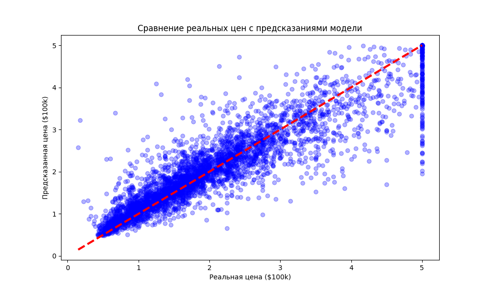

# 🏠 Тұрғын үй бағасын болжау моделі (California Housing)

Бұл жоба халық санағы мәліметтері негізінде Калифорниядағы жылжымайтын мүліктің орташа құнын болжайтын машиналық оқыту жүйесі болып табылады.

## 📋 Жоба туралы сипаттама
Модель келесі 8 негізгі көрсеткішті талдайды:
* Ауданның орташа табысы
* Үйлердің орташа жасы
* Бөлмелер мен жатын бөлмелердің саны
* Халық саны және үй шаруашылықтарының саны
* Географиялық орналасуы (ендік пен бойлық)

## 🛠 Технологиялық стек
Жоба **Python 3.x** тілінде келесі кітапханаларды қолдану арқылы жазылған:
* **Pandas** — кестелік мәліметтерді өңдеу және талдау үшін.
* **Scikit-learn** — машиналық оқыту моделін құру және үйрету үшін.
* **Random Forest Regressor** — негізгі алгоритм (кездейсоқ орман), жоғары дәлдікті қамтамасыз етеді.
* **Joblib** — үйретілген модельді сақтау және жүктеу үшін.
* **Streamlit** — интерактивті веб-интерфейс құру үшін.

## 📂 Репозиторий құрылымы
* `data/` — CSV форматындағы мәліметтер жиынтығы автоматты түрде жүктелетін қалта.
* `models/` — үйретілген модель файлы сақталатын қалта (`.pkl`).
* `main.py` — жобаның негізгі файлы: мәліметтерді жүктеу, модельді үйрету және нәтижелерді бағалау.
* `app.py` — Streamlit арқылы интерактивті веб-интерфейсті іске қосу файлы.
* `requirements.txt` — жоба жұмысы үшін қажетті кітапханалар тізімі.
* `.gitignore` — Git-тен қажетсіз жүйелік файлдарды жасыратын файл.


## Нәтижелерді визуализациялау



## 🚀 Жобаны қалай іске қосу керек

1. **Репозиторийді көшіріңіз:**
   ```bash
   git clone https://github.com/MadCompany-WT/House-price-prediction-model.git
   cd House-price-prediction-model
   
2. **Қажетті кітапханаларды орнатыңыз:**
     ```bash
   pip install -r requirements.txt

3. **Модельді үйретуді іске қосыңыз:**
     ```bash
   python main.py
   
4. **Веб-қосымшаны (интерфейсті) іске қосыңыз:**
   ```bash
   streamlit run app.py
